# SQL-Assignment03

## Dirty Read – `READ UNCOMMITTED`

- Session 1 оновлює місто клієнта, але **не комітить**.
- Session 2 читає ці **некомітнуті** зміни.
- Потім Session 1 робить **ROLLBACK**.

- 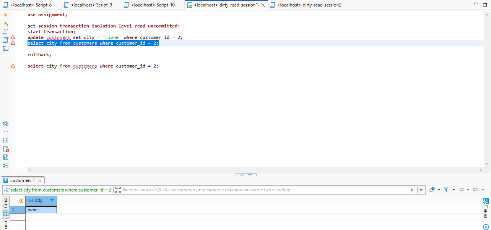
- 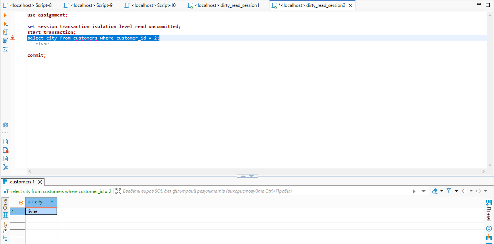
- 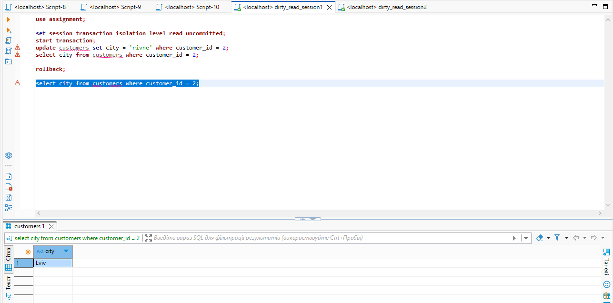

dirty read – зчитування некомітнутих змін. Таке можливо лише на рівні `READ UNCOMMITTED`.

## Non-Repeatable Read – `READ COMMITTED`

- Session 1 читає ім'я клієнта.
- Session 2 змінює його та комітить.
- Session 1 читає знову – результат **відрізняється**.

- 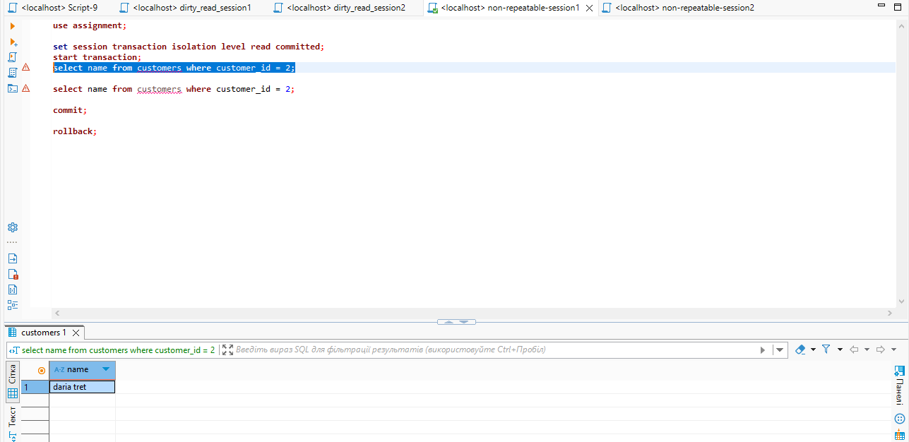
- 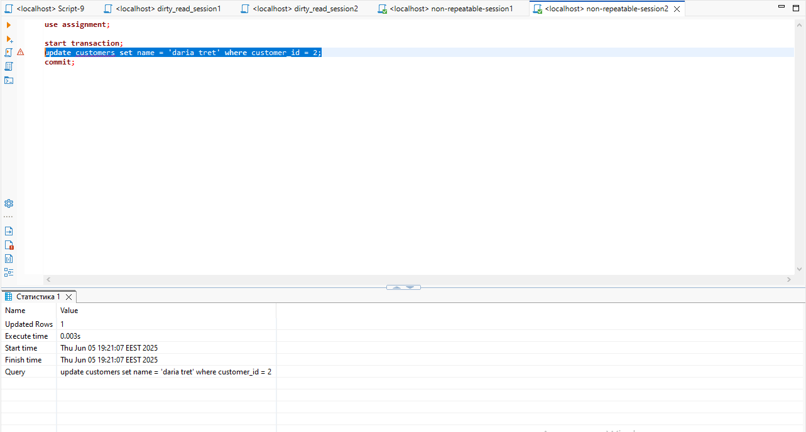
- 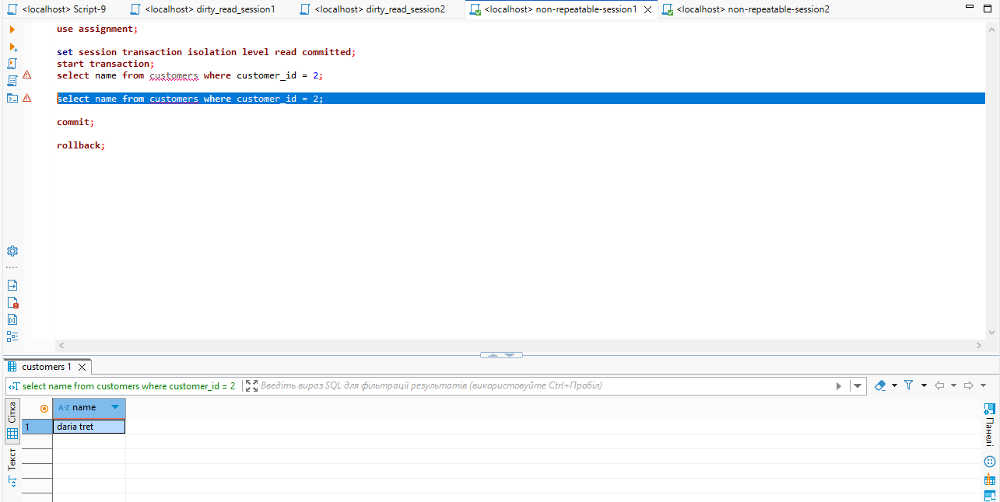

non-repeatable read – один і той самий запит повертає різні результати в одній транзакції. Можливе на `READ COMMITTED`.

## Repeatable Read – `REPEATABLE READ`

- Session 1 читає ім’я клієнта.
- Session 2 змінює його й комітить.
- Session 1 читає знову – бачить **старе значення**, бо транзакція ще не завершена.

- 
- 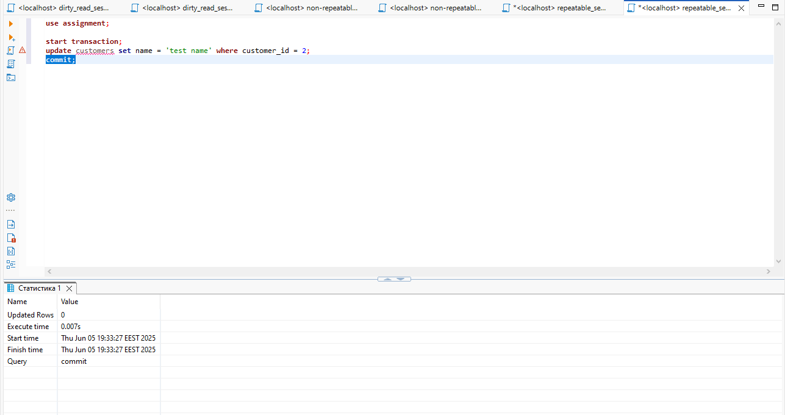
- 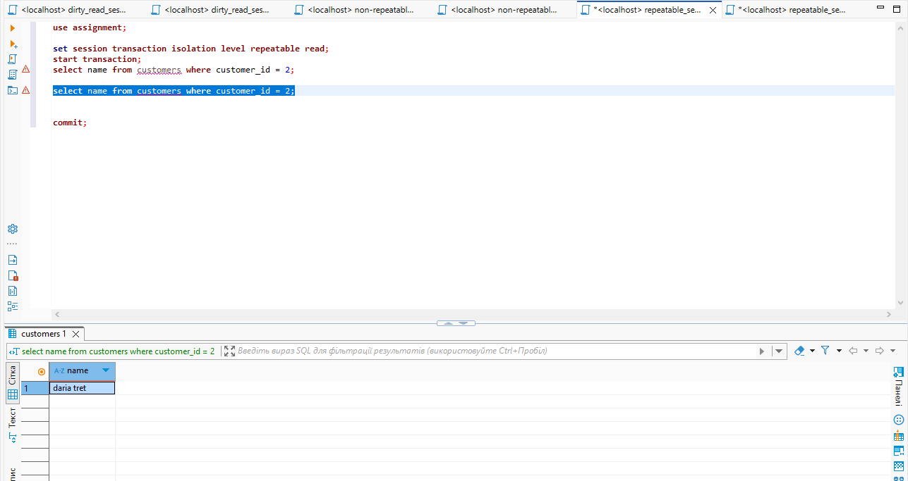

`REPEATABLE READ` гарантує, що в межах однієї транзакції значення не зміниться, навіть якщо хтось інший комітить зміни.

## Порівняння read committed i repeatable read

Повторне зчитування одного й того ж рядка:
- У READ COMMITTED значення може змінитися, якщо інша транзакція внесе і закомітить зміни. Тобто, ті самі дані можуть виглядати по-різному.
- У REPEATABLE READ значення залишиться таким самим протягом усієї транзакції, навіть якщо інші транзакції змінять і закомітять цей рядок.

Видимість нових комітів:
- У READ COMMITTED ти бачиш усі зміни, які були закомічені іншими транзакціями під час твоєї.
- У REPEATABLE READ ти не бачиш нові коміти інших транзакцій до завершення своєї.

Захист від non-repeatable read:
- READ COMMITTED не захищає – одні й ті самі запити можуть дати різні результати.
- REPEATABLE READ гарантує стабільність – результат одного й того ж запиту завжди однаковий у межах транзакції.

## Deadlock

- Session 1 блокує рядок з `id=1`
- Session 2 блокує `id=2`
- Обидві намагаються оновити те, що вже заблоковано іншою сесією

- 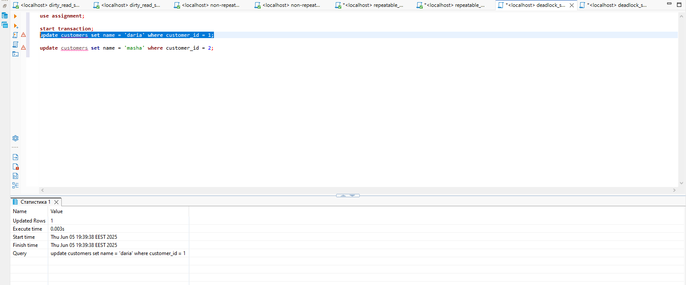
- 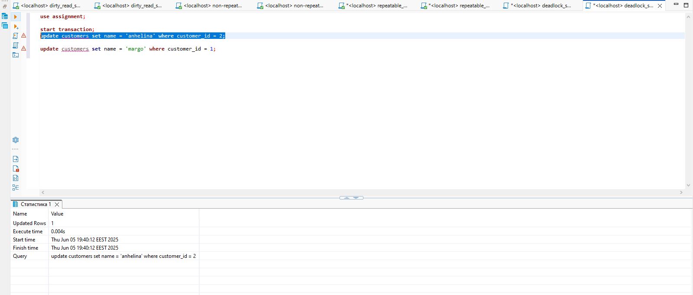
- 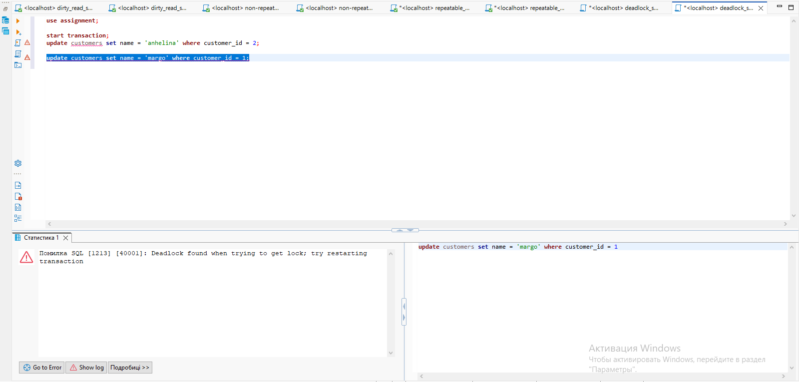

deadlock - кожна транзакція тримає один ресурс і чекає на інший. MySQL виявляє дедлок і **відкочує одну з транзакцій**, щоб звільнити блокування.
